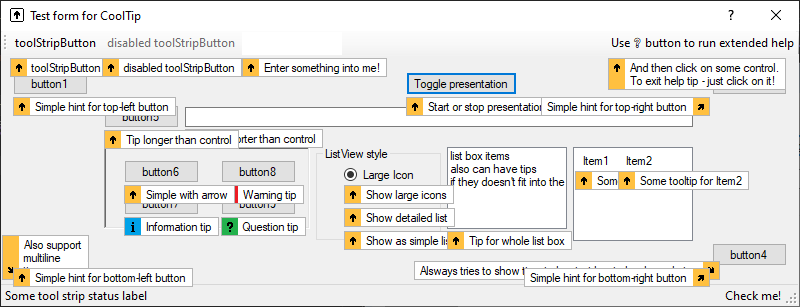

# CoolTip

> Flexible and modern replacement for standard *ToolTip* for *WinForms*. 

## Usage

Place on the form and set `BaseForm` property. That makes relation for component,
because `Component` doesn't receive parent reference during creation.

Set tip text for needed controls with their properties, like it could be done for standard `ToolTip`.

Tip text can starts with:
* `!` (exclamation mark) for red *warning* tip;
* `?` (question mark) for green *explanation* tip;
* `i)` (i and parentheses) for blue *information* tip.
(marks will be cut from tip text).

Also you can set `HelpText` property for your controls and use *Help Button* of the window to provide extended help.

## Extending

You can write your own *visitors* and *managers* to add tip support for own or third-party controls / components.

### Visitors

*Visitors* used to inspect internal controls / components of complex parent, like `ListView`.
`IVisitor` provide only one function `GetItem` to return any nested `object` by mouse coordinates (in absolute screen coordinates).
Or you can create custom *visitor* in-place with `AddVisitor` function.

### Managers

Managers used to extract additional information from target control / component to show it's tip,
where `IManager` provides following functions:
* `GetTip` to get tip text;
* `GetBounds` to get the control / component bounds (needed to create proper tip window geometry);
* `GetVisible` to get visibility of the control / component.

Also could be created in-place with `AddManager` function.

## Manual Tip

You can show tip manually with needed text for any specific control / component with `Show` function.

## Credits

Originally was written by me for *Delphi 7* in 2004-2007 years for own pet-projects.
Source code you can find [here](https://gist.github.com/idokka/a76dc86e8b590bfc5fdb4c7b51ffae9a). Even *20 years ago* I had good skills to write *readable* code (except magic numbers :blush:).
Of course it was adapted and a little bit redesigned :)
More detailed history read in [the article in my blog](https://pimpl.dev/public/cooltip).

## Debugging

Just open solution file and enjoy your modifications.
To automatically register component for your VS designer you need to
enable checkbox *Automatically Populate Toolbox* in the *Windows Form Designer* options.

Will be glad for any optimizations and/or proposals. Feel free to contact me :)

## Features To Implement

* Chain validation, i.e. *show* warning tip if *statement failed* else *check another* validation..
* Add support for other built-in native Windows controls, like `TreeView` etc.
* Add possibility to change icons / icon background colors.
* Possibility to override tip window geometry and tip design (aka *owner draw*).
* Build-and-publish pipeline.

